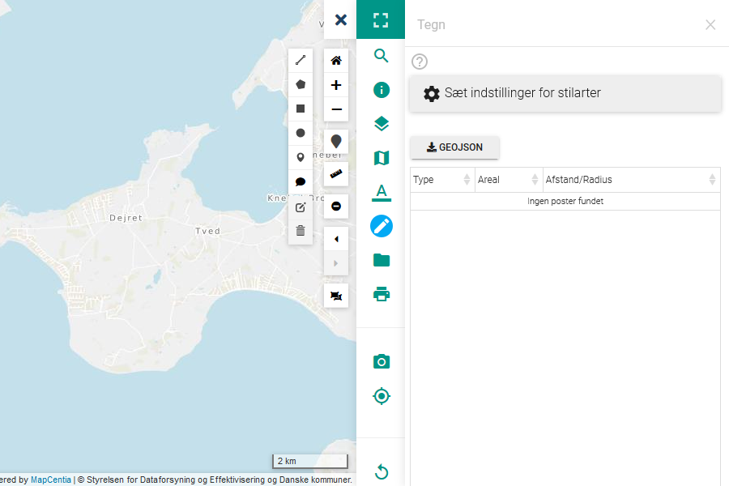
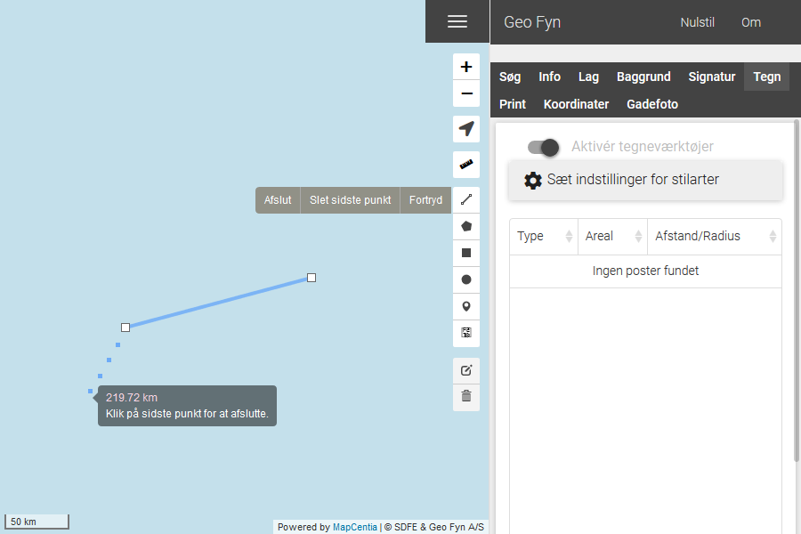
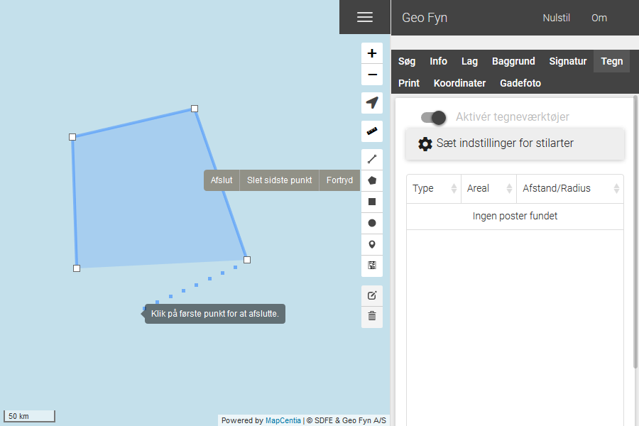
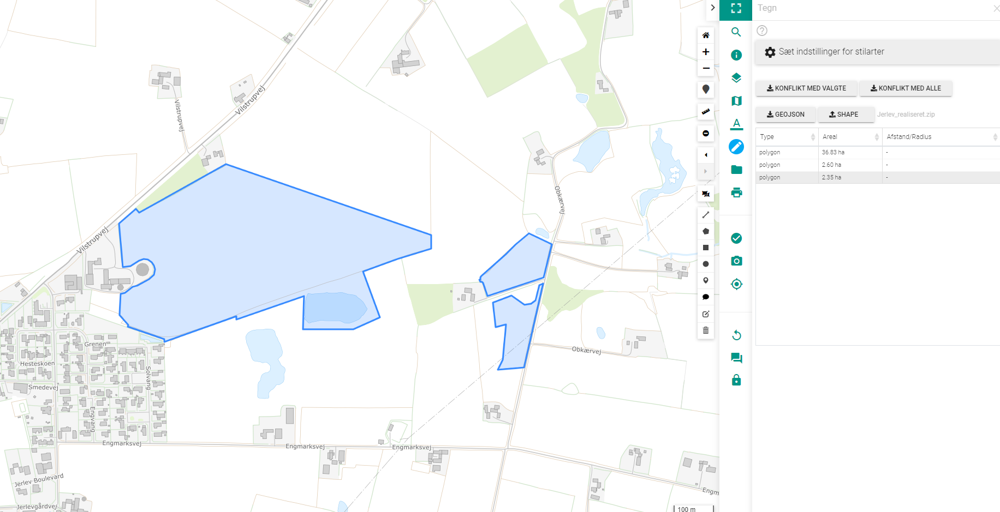
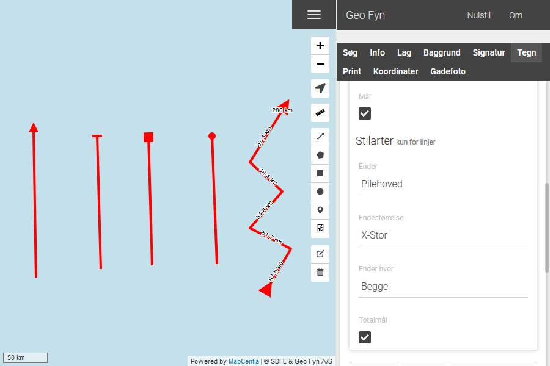
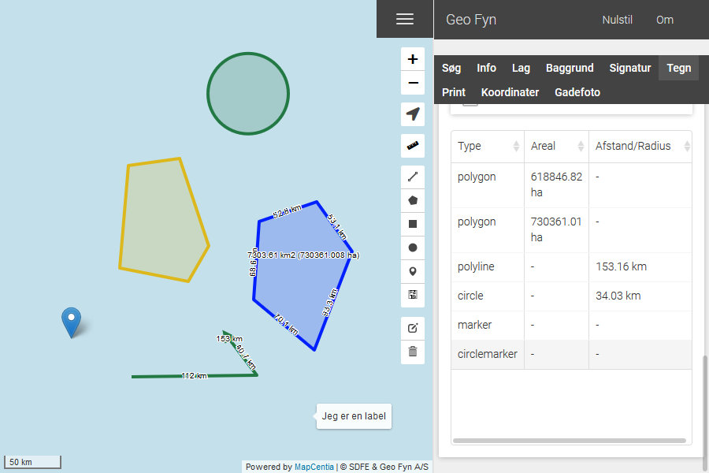

.. _draw:

#################################################################
Tegn
#################################################################

.. topic:: Overview

    :Date: |today|
    :Vidi-version: 2020.11.0
    :Forfatter: `giovanniborella <https://github.com/giovanniborella>`_

.. contents:: 
    :depth: 3

*****************************************************************
Tegn-værktøjet
***************************************************************** 

.. include:: ../../_subs/NOTE_GETTINGSTARTED.rst

Elementer vil også fremgå på PDF-print.

Typer
=================================================================

Når værktøjet er tændt er det muligt at tegne elementer ind på kortet. Elementerne er bundet op på den geografiske placering, så de vil blive selv om man panorerer i kortet.

    Værktøjet er tændt, og klar til at lave elementer.

Tegn elementer
-----------------------------------------------------------------

For at tegne elementer, gøres følgende:

* Linjer: 
    * Klik for at starte linje
    * Tilføj mellempunkter
    * (Slet sidste punkt ved at bruge ``Slet sidste punkt``)
    * Klik på ``Afslut``, eller klik på det sidst tilføjede mellempunkt.

* Arealer/Flader:
    * Klik for at starte flade
    * Tilføj mellempunkter
    * (Slet sidste punkt ved at bruge ``Slet sidste punkt``)
    * Klik på det første punkt for at afslutte

* Rektangel:
    * Klik og træk for at tegne et rektangel

* Cirkel:
    * Klik og træk for at slå cirkel

* Punkt:
    * Klik for placere punkt.

* Annotation:
    * Klik for at placere
    * Indtast notat

Ændre elementer
-----------------------------------------------------------------

Når værktøjet aktiveres er det muligt at ændre knudepunkter mm. for de tegnede elementer. 

.. figure:: ../../../_media/draw-edit.png
    :width: 400px
    :align: center
    :name: draw-edit2
    :figclass: align-center

    Ændre elementerne ved at klikke og trække knudepunkterne (Hvide kasser)

Klik for ``Gem`` for at gemme, ``Fortryd`` for at annulere alle ændringer.

Slet elementer
-----------------------------------------------------------------

Når værktøjet aktiveres er det muligt at fjerne elementer enkeltvis, eller alle på én gang.

Udvælg et mål der skal fjernes.

Klik for ``Gem`` for at gemme, ``Fortryd`` for at annulere alle ændringer.

.. warning:: Klikker man på ``Slet alle`` kan handlingen ikke fortrydes

Upload og download
=================================================================

Med funktionen **GEOJSON** downloades alt tegnet til en geojson fil på den lokale maskine

Med funktionen **SHAPE** kan en shape fil uploades, så det bliver en del af tegnelaget.
Der kan uploades punkter, linjer og flader pakket som en zip-fil. Ved import vises objekter i kortet, med standard (blå) og i listen under 

Ved markering af ét objekt kan man anvende konfliktsøgning med den importerede geometri. 
Alternativt kan man vælge konfliktsøgning med alle importerede geometrier.

**Forudsætninger:**
Der er lavet en afgrænsning for at beskytte løsningen mod store shapefiler. Der håndteres derfor kun filer, indeholdende op til 200 objekter.

Importerer man en fil med flere objekter, vil de ikke blive importeret og brugeren vil blive promptet med en meddelelse herom.
Dette er en almindelig beskyttelse af webløsninger, for at man ikke risikerer at importere et landsdækkende matrikelkort og herved beslaste WebGIS løsningen så den bliver uanvendelig.

Stilart
=================================================================

TBD

Linjer
-----------------------------------------------------------------

Det er muligt at definere en ende på hver linje. Denne indstilling sættes inden man tegner sin linje. 

Der er også mulighed for at få vist mål på linjer, samt totalmål.

    Fra venstre mod højre: Pilehoved, Stop, firkant, punkt. Den sidste linje er sat op som vist i billedet. 

Oversigt
-----------------------------------------------------------------

Nederst vil der være en tabel over de tegnede geometrier. Ved at klikke på en række vil kortet flyve over til den relevante geometri.

    Fra venstre mod højre: Pilehoved, Stop, firkant, punkt. Den sidste linje er sat op som vist i billedet.