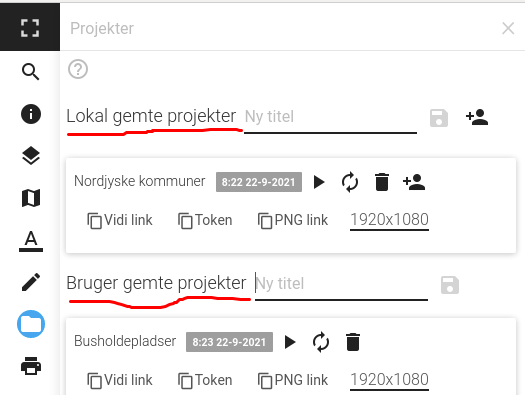

.. _project:

#################################################################
Projekter
#################################################################

.. topic:: Overview

    :Date: |today|
    :Vidi-version: 2020.11.0
    :Forfatter: `giovanniborella <https://github.com/giovanniborella>`_

.. contents:: 
    :depth: 3

*****************************************************************
Projekter
***************************************************************** 

.. include:: ../../_subs/NOTE_GETTINGSTARTED.rst

Projekt
=================================================================

Projekt-værktøjet kan bruges til at gemme og distribuere øjebliksbilleder af kortet.

Når der bliver lavet et projekt, gemmes kort-udstrækningen, tegnede elementer (:ref:`draw`), lag med mere - og kan bruges som en direkte genvej tilbage til hvor man arbejdede tidligere.

Når værktøjet startes, vises en liste med allerede eksisterende projekter.

    Værktøjet er tændt, og klar til at lave projekter.

Det er muligt at tilgå et projekt på flere måder:

* Direkte som link. Et link direkte til et projekt kan se sådan ud:

`http://mapgoviditest.geopartner.dk/app/vandvaerker/public/?state=state_snapshot_35f2ea90-5975-11eb-8a1b-e3cc28c27983`_

* Man få et link til at printe kortet ud som png:

`http://mapgoviditest.geopartner.dk/api/static/vandvaerker/public/?state=state_snapshot_35f2ea90-5975-11eb-8a1b-e3cc28c27983&width=1920&height=1080`_

Skab projekt
-----------------------------------------------------------------

Når kortet er opsat med de relevante lag, baggrundskort, tegninger mv. Indtastes et projektnavn, og man trykker på ``Gem``-knappen.

Knappen er "Disketten" vist på :numfig:`project-on`

Genskab projekt
-----------------------------------------------------------------

For at gå til projektet, klik på "Play"-ikonet. Den gemte opsætning vil nu blive genskabt.

Editér projekt
-----------------------------------------------------------------
Hvis man vil editere et projekt, starter man med at genskabe det - lave ændringerne i baggrundskort mv. og derefter gemme projektet påny.

Det er også muligt at omdøbe projektet.

Slet projekt
-----------------------------------------------------------------

For at slette et projekt bruges "Skraldespand"-ikonet. Der vil komme en pop-up for at bekræfte dit valg. Hvis et projekt slettes er det ikke muligt at genskabe det.