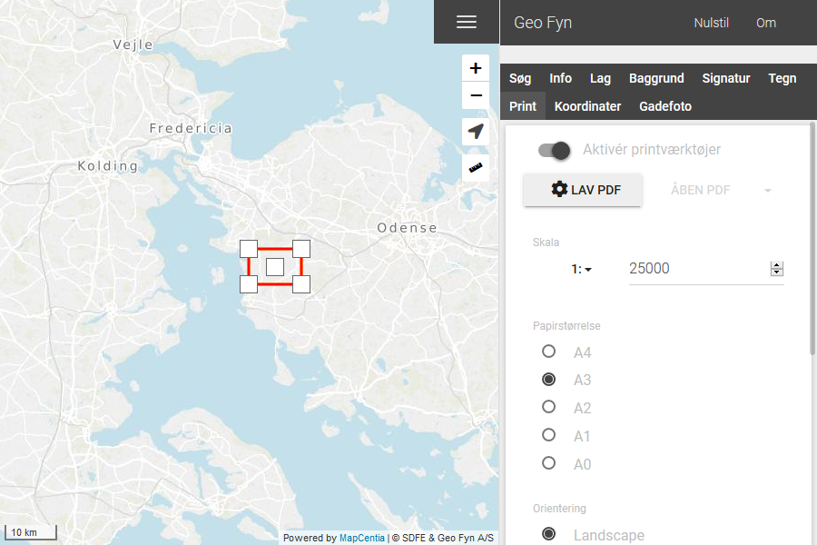
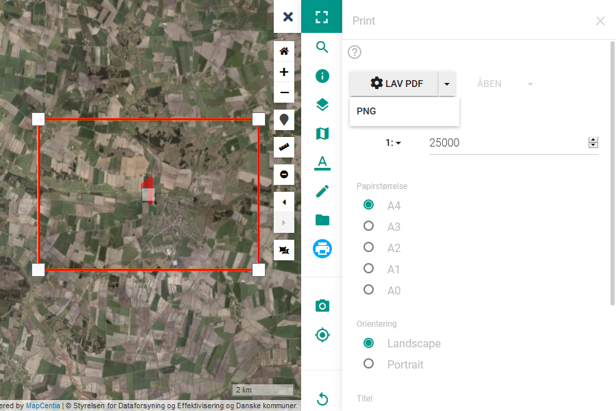
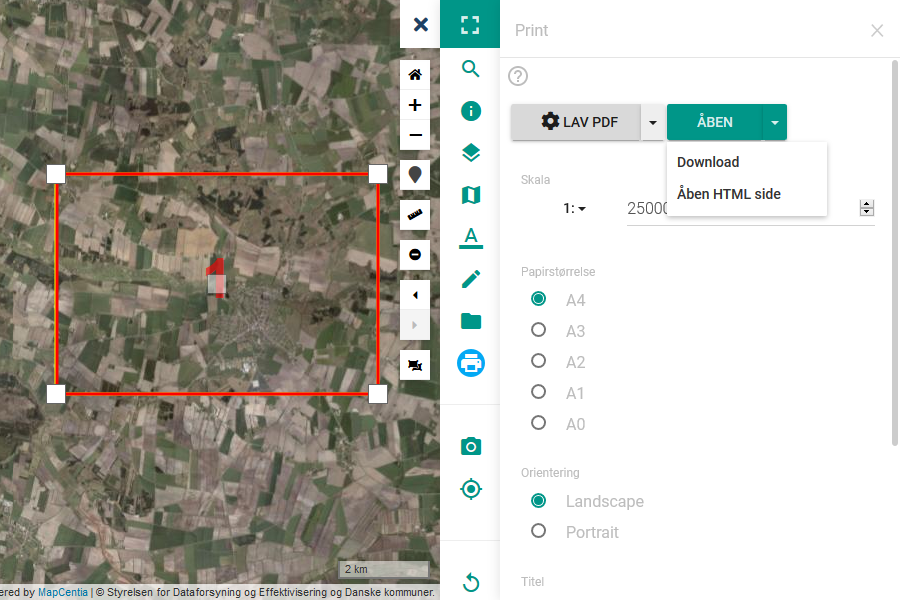

.. _print:

#################################################################
Print
#################################################################

.. topic:: Overview

    :Date: |today|
    :Vidi-version: 2020.11.0
    :Forfatter: `giovanniborella <https://github.com/giovanniborella>`_

.. include:: ../../_subs/NOTE_CONF.rst

.. contents:: 
    :depth: 3

*****************************************************************
Printværktøj
***************************************************************** 

.. include:: ../../_subs/NOTE_GETTINGSTARTED.rst

Når værktøjet vælges er det indledningsvis tændt.

Print
=================================================================

Når værktøjet er tændt vil man se en rød kasser der representerer udskriftsområdet.

    Værktøjet er tændt, og klar til at printe

Muligheder
-----------------------------------------------------------------

Efter print-området er dannet er det muligt i kortvinduet at:

* Flytte området ved hjælp af punktet i midten.
* Ændre målestoksforhold ved at trække i de yderste punkter.

Følgende indstillinger kan også sættes:

* Skabelon  
    * Hvis der er defineret flere skabeloner i konfigurationen, vises disse her
* Papirstørrelse
    * Her vælges den relevante papirstørrelse som er tilgængelig i skabelonen
* Orientering
    * Der understøttes print i `Liggende` og `Stående`
* Titel, Kommentar
    * Hvis disse felter, eller et af disse felder udfyldes vil der være et korthoved indeholdende teksterne på printet.
* Vis signatur
    * Er denne slået til, vil der blive genereret en signatur over de de aktive lag på kortet.

Når man er tilfreds med indstillingerne, klikker man på ``Lav PDF``. Det er også muligt at bruge drop-down til at printe som ``PNG``

    Klar til at printe

    Print er gennemført

Når printet er gennemført har man muligheden for at åbne printet i browseren - eller ved hjælp af drop-down; downloade printet eller få vist kortet i en HTML version.