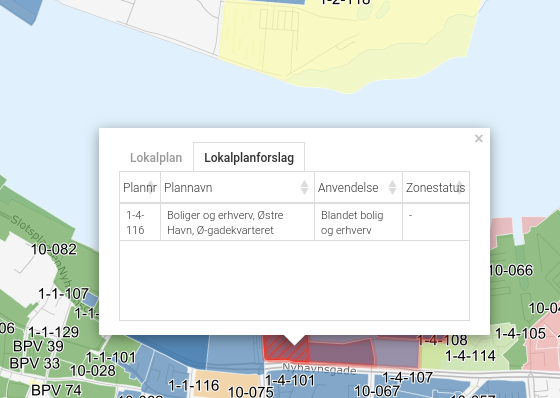
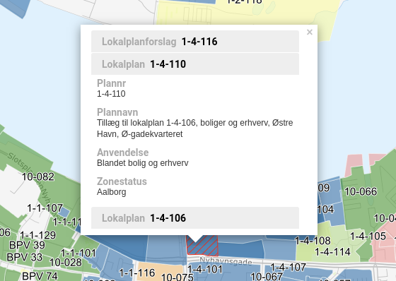

.. _configjson:

#################################################################
Kørselskonfiguration
#################################################################

.. topic:: Overview

    :Date: |today|
    :Vidi-version: 2020.11.0
    :Forfattere: `giovanniborella <https://github.com/giovanniborella>`_ | `mapcentia <https://github.com/mapcentia>`_

.. contents:: 
    :depth: 4

Når vidi startes i browseren læses værdier ind fra :ref:`configjs`. I flere tilfælde kan denne konfiguration ændres til eksempelvis at inkludere bestemte extensions, eller print-templates.

Vidi startes med en URL som denne (uden fragments [#fragment]_):

``https://kort.geofyn.dk/app/geofyn/?config=borgerkort01.json``

Som kan læses sådan:

``https://<host>/app/<database>/?config=<kørselskonfiguration>.json``

Opbygning
*****************************************************************

.. _configjs_schemata:

schemata
=================================================================

Her angives hvilke lag, der skal hente ind i lagtræet. Der er tre måder at angive på:

* *Schema*. Alle lag i schemaet.
* *Lag*. Et enkelt lag.
* *Tag*. Alle lag med taggen.

De tre måder kan kombineres.

.. code-block:: json

    "schemata": [
        "my_schema",
        "my_schema.my_layer",
        "tag:my_tag_1",
        "tag:my_tag_2"
    ],

.. note::
    Lag skal være placeret i en laggruppe for at kunne hentes ind. Dette gøres i GC2 Admin.

.. _configjs_enabledextensions:

enabledExtensions
=================================================================

Her angives hvilke extensions, som skal aktiveres.

.. code-block:: json

    "enabledExtensions": [
        "conflictSearch",
        "streetView",
        "session",
        "coordinates",
        "offlineMap",
        "editor",
        "configSwitcher",
        "embed"
    ],

.. _configjs_extensionconfig:

extensionConfig
=================================================================

Her kan opsætningen af de enkelte extensions laves. Det er ikke alle extensions, som har sine egne indstillinger.

Opsætningen sker efter følgende princip:

.. code-block:: json

    "extensionConfig": {
        "extensionNavn1": {},
        "extensionNavn2": {}
    }

Her følger hvordan de enkelte extensions kan opsættes (Pt. omfatter denne del af dokumentationen ikke alle extensions)

.. code-block:: json

    "extensionConfig": {
        "streetView": {
            "cowi": "https://cmv.cowi.com/?...",
            "mapillary": "https://mapillary.com/app/?..."
        "embed": {
            "slideOutLayerTree": true,
            "expandFirstInLayerTree": true
        }
    }

.. _configjs_enabledprints:

enabledPrints
=================================================================

Her angives hvilke print-templates der skal være adgang til. Angives flere end én kan brugeren vælge mellem dem i print-dialogen.

.. code-block:: json

    "enabledPrints": ["print", "print_sagsbehandler"],

.. _configjs_enabledsearch:

enabledSearch
=================================================================

Her angives hvilket søgemodul, der skal være aktiveret. Pt. er der to standard moduler:

* ``danish`` Søgning på danske adresser, jordstykker og ejendomme
* ``google`` Google's Place Search (kræver Google API Key. Se :ref:`configjs_searchconfig`)

.. code-block:: json

    "enabledSearch": "danish",

.. _configjs_searchconfig:

searchConfig
=================================================================

Her kan det valgte søgemodul konfigureres.

* ``size`` Hvor mange forslag skal der vises.
* ``komkode`` Hvilket eller hvilke kommunekoder skal søgningen omfatte. Angives enten som "851", ["851", "727"] eller "*"
* ``esrSearchActive`` Aktiver søgning på esr ejendomsnummer
* ``sfeSearchActive`` Aktiver søgning på sfe ejendomsnummer
* ``placeholderText`` Udskift standard-teksten med en anden
* ``google`` Google API key.

.. code-block:: json

    "searchConfig": {
        "size": 10,
        "komkode": "851",
        "esrSearchActive": true,
        "sfeSearchActive": true,
        "placeholderText": "Søg på et eller andet",
        "google": {"apiKey": "abc123"}
    },

.. note::
    Indstillerne har kun indflydelse på "danish" søgemodulet Kun "google" vedrører Google Place Search og behøver ikke udfyldes, hvis det ikke bruges. Google API kan også sættes i GC2.

.. _configjs_template:

template
=================================================================

Her angives hvilken template, som skal bruges. Angives det ikke, bruges standard-templaten ``default.tmpl``.
Egne Templates kan placeres på egen server ved angivelse af :ref:`configUrl<configjs_configurl>` indstillingen.

.. code-block:: json

    "template": "default.tmpl",

.. _configjs_brandname:

brandName
=================================================================

Her kan sættes en tekst som placeres vha. en placeholder i templates.

.. code-block:: json

    "brandName": "Mit brandnavn",

.. _configjs_baselayers:

baseLayers
=================================================================

Opsætning af tilgængelige base layers kan ske på fire forskellige metoder:

* Indbyggede lag
* WMS lag
* XYZ lag
* GC2 lag

.. code-block:: json

    "baseLayers": [
        {"id": "osm", "name": "Open Street Map"},
        {"id": "stamenToner", "name": "Stamen Toner"},
        {"id": "stamenTonerLite", "name": "Stamen Toner Light"},
        {"id": "bingRoad", "name": "Bing Road"},
        {"id": "bingAerial", "name": "Bing Aerial"},
        {"id": "hereNormalDay", "name": "HERE Normal Day"},
        {"id": "hereNormalDayGrey", "name": "HERE Normal Day Grey"},
        {"id": "hereNormalNightGrey", "name": "HERE Normal Night Grey"},
        {"id": "hereSatelliteDay", "name": "HERE Satellite Day"},
        {"id": "hereHybridDay", "name": "HERE Hybrid Day"},
        {"id": "googleStreets", "name": "Google Streets"},
        {"id": "googleHybrid", "name": "Google Hybrid"},
        {"id": "googleSatellite", "name": "Google Satellite"},
        {"id": "googleTerrain", "name": "Google Terrain"},
        {
            "type": "wms",
            "url": "https://services.kortforsyningen.dk/service?SERVICENAME=forvaltning2&token=abc123&",
            "layers": ["Basis_kort", "Navne_basis_kort", "Husnummer"],
            "id": "Basis_kort",
            "name": "Forvaltningskort",
            "description": "Basis_kort",
            "attribution": "Styrelsen for Dataforsyning og Effektivisering",
            "minZoom": 8,
            "maxZoom": 22,
            "maxNativeZoom": 22
        },
        {
            "type": "XYZ",
            "url": "https://m3.mapserver.mapy.cz/base-m/{z}-{x}-{y}?s=0.3&dm=Luminosity",
            "id": "mapy",
            "name": "Mapy",
            "description": "Kort fra Mapy",
            "attribution": "Mapy",
            "minZoom": 8,
            "maxZoom": 20,
            "maxNativeZoom": 19
        },
        {
            "type": "gc2",
            "id": "geodk.bright-01052019",
            "name": "GeoDanmark kort",
            "db": "baselayers",
            "host": "https://dk.gc2.io",
            "config": {
                "minZoom": 8,
                "maxZoom": 30,
                "maxNativeZoom": 26,
                "attribution": "&copy; SDFE & MapCentia ApS"
            }
        }
    ],

.. note::
    HERE, Bing og Google Maps kræver API nøgle opsat i GC2. Google Maps fungerer på en anden måde end andre lag og langt fra optimalt. Fx kan man ikke printe Google Maps.

.. _configjs_aboutbox:

aboutBox
=================================================================

Her kan sættes en tekst eller HTML som vises i About Box.

.. code-block:: json

    "aboutBox": "
Her kan der indsættes HTML
",

.. _configjs_startupmodal:

startUpModal
=================================================================

Hvis angivet, vil et modal-vindue vises ved opstart med tekst eller HTML. Vinduet kan skjules en gang eller for altid (indtil cookies nulstilles eller indeholdet ændres).

.. code-block:: json

    "startUpModal": "
Her kan der indsættes HTML
",

.. _configjs_startupmodalsupressiontemplates:

startupModalSupressionTemplates
=================================================================

:ref:`startUpModal <configjs_startupmodal>` kan undertrykkes ved udvalgte templates. Templates kan angives ved navn eller regular expression.

.. code-block:: json

    "startupModalSupressionTemplates": ["print.tmpl", "blank.tmpl", {
        "regularExpression": true,
        "name": "print_[\\w]+\\.tmpl"
    }],

.. _configjs_featureinfoonmap:

featureInfoTableOnMap
=================================================================

Når denne er sat til ``true`` vises feature-info tabellerne i en popup på kortet i stedet for i sidepanelet. Det gør indstillingen veleget til embed template.
Ved brug af "avanceret forespørgelse" vises tabellerne dog stadig i sidepanelet.

.. code-block:: json

    "featureInfoTableOnMap": true,

.. note::
    Kan ikke anvendes i sammenhæng med :ref:`configjs_crossmultiselect`

.. _configjs_crossmultiselect:

crossMultiSelect
=================================================================

Når denne er sat til ``true`` vil feature info klik fange både raster- og vektor-lag og opstille de enkelte resultater i en "harmonika". Derved inddeles resultatet ikke efter hvilke lag de tilhører.
Overskrifterne har to dele:

* ``Accordion summery prefix`` En fritekst efter eget valg.
* ``Accordion summery`` En celle værdi, angivet med kolonnenavn.

Ovenstående sættes i GC2 Meta.

.. code-block:: json

    "crossMultiSelect": true,

.. note::
    Hvis et lag er editerbart, vises "blyant" og "skraldespand" ikonerne ikke i pop-up'en.

.. _configjs_activatemaintab:

activateMainTab
=================================================================

Sæt hvilket modul, som skal være aktivt fra starten. Mulighederne er:

* search
* info
* layer
* baselayer
* legend
* draw
* state-snapshot
* print
* conflict
* streetView
* coordinates

.. code-block:: json

    "activateMainTab": "info"

.. _configjs_cssfiles:

cssFiles
=================================================================

Load eksterne CSS filer. Filerne skal placeres på en HTTP server, som forbindes til vha. :ref:`configUrl<configjs_configurl>`

.. code-block:: json

  "cssFiles": [
       "myStyles1.css",
       "myStyles2.css"
  ]

.. _configjs_dontuseadvancedbaselayerswitcher:

dontUseAdvancedBaseLayerSwitcher
=================================================================

Deaktiver dobbeltgrundskort funktionen.

.. code-block:: json

    "dontUseAdvancedBaseLayerSwitcher": true

.. _configjs_infoclickcursorstyle:

infoClickCursorStyle
=================================================================

Sæt hvilken CSS cursor style markøren skal have når feature-info modulet er aktivt. Default er "crosshair".

Andre muligheder kan ses `her <https://developer.mozilla.org/en-US/docs/Web/CSS/cursor>`_.

.. code-block:: json

    "infoClickCursorStyle": "crosshair"

.. rubric:: Fodnoter

.. [#fragment] Et fragment er den del af en URL der kommer efter `#`.
