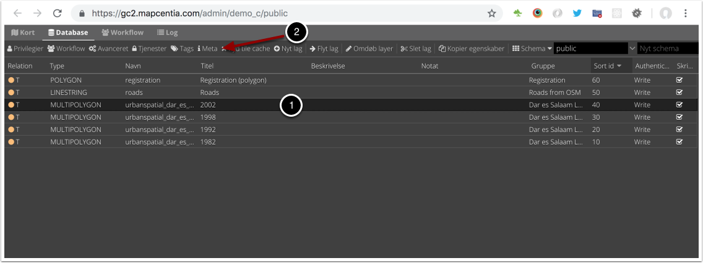
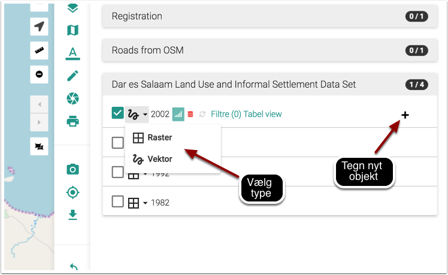
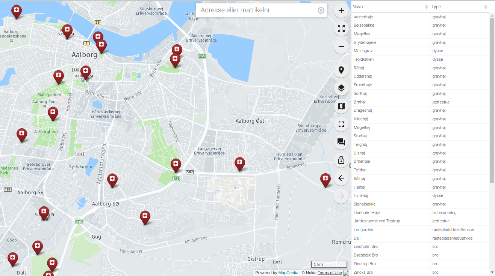
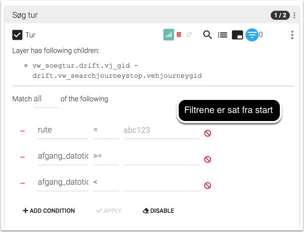
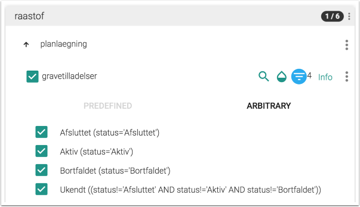
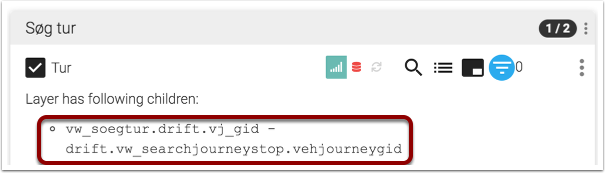
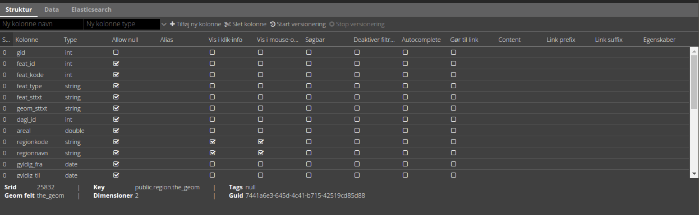
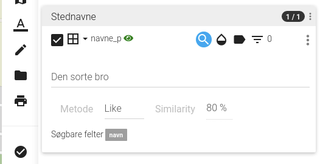
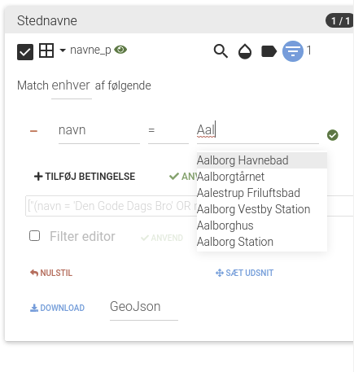

.. _gc2meta:

#################################################################
Lagopsætning fra GC2
#################################################################

.. topic:: Overview

    :Date: |today|
    :Vidi-version: 2020.11.0
    :Forfattere: `mapcentia <https://github.com/mapcentia>`_

.. contents::
    :depth: 4

*****************************************************************
GC2 Meta information
*****************************************************************

GC2 har et konfigurerbart Meta Data system med egenskaber tilknyttet de enkelte lag, som Vidi læser ved opstart. Egenskaberne omfatter fx om lag kan editeres, om et lag skal vises som tile- eller vektorlag osv.

|
Herunder følger de forskellige egenskaber, der har betydning for Vidi.

.. _gc2mata_infopopup:

Info pop-up
=================================================================

**Pop-up template**

Indeholdet i feature-info pop-up'en styres vha. en template, som anvender sproget `handlebars <https://handlebarsjs.com>`_

Hvis der ikke angives en template, så anvendes en standard, som looper felterne igennem og lister dem. Den ser således ud:

.. code-block:: handlebars

    

        <h3 class="popup-title">{{_vidi_content.title}}</h3>
        {{#_vidi_content.fields}}
            {{#if value}}
                <h4>{{title}}</h4>
                
{{{value}}}

            {{/if}}
        {{/_vidi_content.fields}}
    

**Element selector**

Hvilket DOM element skal pop-up templaten renderes i? Kan bruges til brugerdefinerede templates.

**Function**

En JavaScript funktion som kaldes når feature-info foretages. En række argumenter bliver sendt til funktionen, herunder det objekt man har klikket i GeoJSON formatet.

.. code-block:: javascript

    function(feature, layer){
        alert(feature.properties.regionnavn)
    }

**Select function**

En JavaScript funktion, som kaldes når der vælges en række i feature-listen. Id på Leaflet layer samt selve Leaflet layer bliver sendt som argumenter.

.. code-block:: javascript

    function(id, layer){
        alert(layer.feature.properties.regionnavn)
    }

**Accordion summery prefix**

Anvendes ved brugen af :ref:`configjs_crossmultiselect`

**Accordion summery**

Anvendes ved brugen af :ref:`configjs_crossmultiselect`

.. _gc2mata_layertype:

Layer type
=================================================================

**Type**

Hvilken type skal laget have i Vidi? Enten Vector eller Tile. Tile er WMS fra MapServer/QGIS Server og er standard. Hvis Vector vælges vil Vidi hente rå-dataene og vise som et vektorlag. Vektorlag gemmes i browseren og kan bruges uden netværk. Hvis begge tjekkes af, vil man kunne vælge mellem dem i lag-træet.

.. note::
    Typerne WebGL og MVT (vector tiles) er eksperimentielle og virker givetvis ikke i Vidi.

**Default**

Hvilken type skal være valgt fra starten.

.. _gc2mata_tables:

Tables
=================================================================

**Zoom on select**

Skal der zoomes ved valg af objekt i feature-info-tabellen?

**Max zoom level**

Hvis der zoomes, så kan maks zoom-level sættes. Jo højere tal jo længere ind zoomes der. Er speciel anvendelig ved punktlag, hvor der altid zoomes maks ind. Standard sat til 17.

.. _gc2mata_editor:

Editor
=================================================================

**Editable**

Skal laget være editerbart? Både Tile og Vector kan editeres. Det anbefales dog at benytte Vector til lag, som skal editeres i marken, da der er fuld funktionalitet uden netværk eller med langsom forbindelse.

|
.. _gc2mata_tilesettings:

Tile settings
=================================================================

(Har kun betydning for lag af typen Tile)

**Use tile cache (WMS)**

Hvis tjekket af, vil Vidi omgå MapCache og trække laget direkte fra WMS. Dette gør, at laget altid er synkront med databasen. Ulempen er, at databasen bliver belastet mere, så dette er ikke velegnet til lag, som har mange samtidige visninger.

**Tile service URI**

Denne egenskab bevirker, at laget tiles bliver trukket fra et brugerdefineret API. Fx en extension til GC2.

**Selected style**

Her kan angives et style-objekt, som styrer hvordan det valgte objekt bliver markeret ved feature-info. Hvis det angives anvendes e. standard styling.

Eksempel på et style-objekt:

.. code-block:: json

    {
        "color": "green",
        "weight": 2,
        "fillColor": "red",
        "opacity": 0,
        "fillOpacity": 0.5,
        "dashSpeed": 5
    }

.. _gc2mata_vectorsettings:

Vector settings
=================================================================

(Har kun betydning for lag af typen Vector)

**Load strategy**

Kan enten være Static eller dynamic. Static betyder, at alle lagets data bliver hentet fra databasen, når laget tændes. Ved dynamic hentes kun de data, som er synlige inden for kortet viewport plus en buffer. Når der zoom/panes bliver nye data hentet, hvis det er nødvendigt. Static er standard.

**Max features**

Hvor mange features skal skal der max leveres? Når laget tændes og max bliver nået, vises ingen features i laget og brugeren bliver informeret om, at max blev nået.

**Use clustering**

Aktiverer Leaflet Cluster Map på laget.

**Point to layer**

Vektor-punkter punkter kan vises som enten circle markers eller grafiske markers. Førstnævnte kan sammenlignes med vektor-linjer og flader og vil anvende nedenfornævnte Style function.

Men punkter kan også vises som grafisk markers. Vidi har indbygget Leaflet Plugin'en `Extra Markers <https://github.com/coryasilva/Leaflet.ExtraMarkers>`_ med `Font Awesome <https://fontawesome.com>`_ , som anvendes uden videre.

.. code-block:: javascript

    function(feature, latlng) {
        return L.marker(latlng, {
            icon: L.ExtraMarkers.icon({
                icon: 'fa-home',
                markerColor: 'blue',
                shape: 'circle',
                prefix: 'fa',
                iconColor: '#fff'
            })
        });
    }

**Style function**

Funktion til styling af vektor-lag. Funktionen modtager hver enkelt feature i laget og leverer en style tilbage. Man kan derved lave meget anvanceret tematiseringer./

.. code-block:: javascript

    function(feature) {
        return {
            color: 'green',
            weight: 2,
            fillColor: 'red',
            opacity: 0.5,
            fillOpacity: 0.5,
            radius: 25
        }
    }

**Show table**

Hvis tjekket af og laget bliver tændt som vektor vil en tabel med lagets attributter vises.
Kolonnerne styres af ``Vis i klik-info`` og ``Alias`` i GC2 Admin. Der kan kun vises en tabel ad gangen.
Hvis der allerede er en tabel åben, sker der ingenting ved åbning af en anden - det første lag skal slukkes før en anden tabel kan åbnes.
Virker kun i embed template.
Positionen og bredde/højde på tabellen kan styres gennem :ref:`Kørselskonfiguration (configs)<configjs_vectorTable>`

**Reload Interval**

Hvis dette sættes vil laget refreshe i det angivne interval. Angives i millisekunder.

**Reload callback**

Hvis ovenfor er sat, vil denne funktion blive kørt ved hvert refresh.

**Disable feature info**

Deaktiverer feature-info på vektor-laget.

**Max zoom**

Højeste zoom-level hvor laget skal være synligt. Værdien skal være en tile-set zoom level (0-20). Virker for både vektor og marker lag.

**Min zoom**

Laveste zoom-level hvor laget skal være synligt. Værdien skal være en tile-set zoom level (0-20). Virker for både vektor og marker lag.

**Tooltip template**

Hvis der angives en tooltip template får hver vektorfeature et tooltip/label med værdien. Templaten har adgang til alle attributter for feature:

.. code-block:: html

   <i>{{plannavn}} {{plannr}}</i>

.. _gc2mata_filters:

Filters
=================================================================

**Filter config**

Her kan der foruddefineres hvilke filtre, der skal være parate til brug fra starten. Derved skal brugeren blot skrive værdier i filtrene og klikke Apply.

Filteropsætningen er en liste af objekter med hver to egenskaber: field og operator. Eksempel på en opsætning:

.. code-block:: json

    [
      {"field": "id","operator": "="},
      {"field": "datotid_fra","operator": ">="},
      {"field": "datotid_til","operator": "<"}
    ]

Som giver dette resultat:

|
**Predefined filters**

Præ-definerede filtre gør det muligt, at aktivere fastsatte filtrer med en tjekboks. Som udgangspunkt er et filter aktiveret og som match bruges altid "Any". Dette er velegnet til at give brugeren mulighed for at slukke/tænde klasser i kortet. Et eksempel på Præ-definerede filtre kan ses nedenunder. Først skrives titlen på filteret og på højresiden skrives selve filtret, som er en SQL where clause.

.. code-block:: json

    {
          "Afsluttet": "status='Afsluttet'",
          "Aktiv": "status='Aktiv'",
          "Bortfaldet": "status='Bortfaldet'",
          "Ukendt": "(status!='Afsluttet' AND status!='Aktiv' AND status!='Bortfaldet')"
    }

Eksemplet ser sådan ud i lag-træet:

|

**Default match**

Hvad skal match være som standard: All eller Any

**Immutable**

Hvis denne egenskab er slået til kan filteropsætningen ikke ændres i Vidi.

.. _gc2mata_mouseover:

Mouse over
=================================================================

**Activate mouse over**

Aktiverer mouse over på laget. Virker på tile- og vektor-lag.

**Template**

Indeholdet i mouse over labelen styres vha. en template, som anvender sproget `handlebars <https://handlebarsjs.com>`_

Hvis der ikke angives en template, så anvendes en standard, som looper valgte felterne (tjekket af i :ref:`gc2structure_mouseover`) igennem og lister dem. Den ser således ud:

.. code-block:: handlebars

    

        {{#each data}}
            {{this.title}}: {{this.value}}  
        {{/each}}
    

**Cache UTF grid**

Ved mouse over på tile-lag anvendes et såkaldt UTF grid, som er en slags interaktivt lag, som loades bag tile-laget. Det kræver database og CPU resourcer at danne disse grids, så det er muligt at cache dem, således allerede brugte grids ikke skal gendannes.

.. _gc2mata_references:

References
=================================================================

**Referenced by**

Her kan et lag linkes til et eller flere andre lag. Dvs. at når "forældre"-laget filtreres, så bliver "børne"-lagene også filtreret. forældre-laget og børne-lagene skal kunne linkes samme efter princippet med en nøgle og fremmednøgle: Forældre-laget skal have en et unikt nøglefelt, som optræder som fremmednøglefelt i børne-lagene.

Opsætningen sker i forældre-laget, som refererer til børne-lagene.

I eksemplet nedenunder refererer børne-laget drift.vw_searchjourneystop til forældrelaget, som har det unikke nøglefelt vj_gid. Fremmednøglen i børne-laget hedder vehjourneygid.

Her er der kun ét børne-lag, men der skrives flere objekter ind i listen.

.. code-block:: json

    [
        {
            "rel": "drift.vw_searchjourneystop",
            "parent_column": "vj_gid",
            "child_column": "vehjourneygid"
        }
    ]

I Vidi i laget-træet kan børne-lagene ses på forældre-laget:

|

.. _gc2mata_layerstree:

Layer tree
=================================================================

**Sub group**

Denne egenskab kan gruppere lag i en under-lag-grupper. Alle lag med samme Sub group vil blive samlet i en gruppe. Lagene skal ligge i samme GC2 Group.

Man kan have uendelig mange undergrupper og stien af undergrupper, hvor laget skal befinde sig skal angives således:

.. code-block:: json

    sub group 1|sub group 2|sub group 3|sub group 4

**Open tools**

Her kan angives om et lags værktøjer skal være åbne fra starten. Hvilke værktøjer, der skal være åbne, angives således:

.. code-block:: json

    ["filters"]

I ovenstående tilfælde vil filter-værktøjerne være åbne.

Her ses alle mulighederne:

.. code-block:: json

    ["filters","opacity","load-strategy","search"]

**Disable check box**

Laget kan låses. Det låses op, hvis laget er registreret som "barn" til et andet lag gennem :ref:`gc2mata_references`, hvorpå der aktiveres et filter.

*****************************************************************
GC2 Struktur-fanen
*****************************************************************

I GC2's struktur-fane kan der laves en række indstillinger på feltniveau.

|

Alias
=================================================================

Giv feltet et alias, som vises i stedet for det tekniske feltnavn i Vidi. Kan indeholde specialtegn

Vis i klik-info
=================================================================

Medtag feltet i feature-info. Gælder kun ved brugen af standard pop-up templaten. (se :ref:`gc2mata_infopopup`)

.. _gc2structure_mouseover:

Vis i mouse-over
=================================================================

Medtag feltet i mouse-over. Gælder kun ved brugen af standard mouse-over-templaten. Men skal klikkes af, hvis feltet overhovedet skal med i UTF Grid'et. (se :ref:`gc2mata_mouseover`)

Søgbar
=================================================================

Gør feltet søgbart i lagets fritekstsøgning.

|

Deaktiver filtrering
=================================================================

Ekskluder feltet fra lag-filtrering.

Autocomplete
=================================================================

Aktiver autocomplete på feltet i filtrering.

|

.. _gc2structure_link:

Gør til link
=================================================================

Hvis feltet indholder en web-adresse gøres det til et aktivt link i pop-up'en.

.. note::
    Hvis der anvendes en brugerdefineret pop-up template, har denne indstilling ingen effekt (se :ref:`gc2mata_infopopup`)

Content
=================================================================

Hvis feltet indeholder et link til et billede eller mp4-video kan der her vælges typen. Ved brug af standard templaten bliver billedet eller videoen sat ind (se :ref:`gc2mata_infopopup`)

.. note::
    Hvis der anvendes en brugerdefineret pop-up template, har denne indstilling ingen effekt (se :ref:`gc2mata_infopopup`)

.. _gc2structure_link_prefix:

Link prefix
=================================================================

Hvis :ref:`gc2structure_link` er tjekket af, kan der sættes en tekst-streng foran linket. Fx hvis ``https://`` mangler i linket (fx ``minside.dk/mitdok.pdf``) således det blivet et gyldigt link.

.. note::
    Hvis der anvendes en brugerdefineret pop-up template, har denne indstilling ingen effekt (se :ref:`gc2mata_infopopup`)

Link suffix
=================================================================

Som ved :ref:`gc2structure_link_prefix` men bare bagved. Fx hvis feltet kun indeholder en titel på et dokument: ``mitdok``, så kan ``https://minside.dk`` sættes som prefix og ``.pdf`` som suffix. og resultatet bliver ``https://minside.dk/mitdok.pdf``.

.. note::
    Hvis der anvendes en brugerdefineret pop-up template, har denne indstilling ingen effekt (se :ref:`gc2mata_infopopup`)

Template
=================================================================

Hvis værdien af et felt skal udtrykkes i pop-up og tabel ved andet end selve den rå værdi kan der indsættes en template for feltet. En template har adgang til alle objektets attributter. Fx kan der defineres en template, som skaber et link med link-tekst og ``title`` og ``aria-label`` attributter fra et andet felt. Fx:

.. code-block:: html

   <a href="{{doklink}}" target="_blank" title="Link til lokalplan {{plannavn}} {{plannr}} som pdf" aria-label="Link til lokalplan {{plannavn}} {{plannr}} som pdf">{{plannr}} {{plannavn}}</a>

.. note::
    Hvis der anvendes en brugerdefineret pop-up template, har denne indstilling ingen effekt (se :ref:`gc2mata_infopopup`)

Egenskaber
=================================================================

Her kan der defineres hvilke værdier, der kan være i feltet. Hvis dette defineres, vil der i Vidi's filter og editerings funktioner blive dannet en drop-down-liste, hvor værdierne kan vælges. Det vil altså ikke være muligt at indtaste vilkårlige værdier.

Listen af værdier kan defineres på en række forskellige måder.

**Reference-tabel**

Værdier kan komme fra en anden tabel i databasen. Dette angives ved tre parameter i et JSON objekt:

.. code-block:: json

    {"_rel":"schema.tabel", "_value":"feltnavn", "_text":"feltnavn"}

* ``_rel`` angiver reference-tabellen (eller view) som schema-kvalificeret (schema-navnet skal angives foran tabelnavnet).
* ``_value`` angiver feltet, som indeholder værdierne.
* ``_text`` angiver feltet, som indeholder den tekst, der skal vises i drop-down-listen. Dette felt kan godt være det samme som ovenstående _value felt.

**Værdi-tekst liste**

Værdier kan angive som en liste af værdi-tekst par i et JSON objekt. Dvs. at det er teksten (venstre side), som bliver vist i drop-down-listen, mens værdien (højre side) bliver anvendt.

.. code-block:: json

    {"tekst_1":"1","tekst_2":"2","tekst_3":"3"}

**Værdi liste**

Værdier kan angives som en liste i et JSON array. Værdierne bliver vist i drop-down-listen.

.. code-block:: json

    [1,2,3]

Listen kan både bestå af tal og tekster.

**Wild card**

Der kan dannes en drop-down-liste af samtlige unikke værdier som allerede findes i feltet. Det gøres ved at indsætte ``*`` i feltet.

