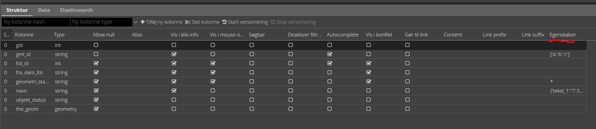

.. _gc2meta:

#################################################################
Lagopsætning fra GC2
#################################################################

.. topic:: Overview

    :Date: |today|
    :Vidi-version: 2020.11.0
    :Forfattere: `mapcentia <https://github.com/mapcentia>`_

.. contents::
    :depth: 4

*****************************************************************
GC2 Meta information
*****************************************************************

GC2 har et konfigurerbart Meta Data system med egenskaber, som Vidi læser ved opstart. Egenskaberne omfatter fx hvilke lag, som kan editeres, om et lag skal vises som tile- eller vektorlag osv. GC2 skal være sat op med de rigtige Meta Data egenskaber, før det kan bruges sammen med Vidi.

Herunder følger de forskellige egenskaber, der har betydning for Vidi.

.. _gc2mata_layertype:

1) Layer type
=================================================================

**Type**

Hvilket type skal laget have i Vidi? Enten Vector, Tile eller Both. Tile er standard. Hvis Vector vælges vil Vidi hente rå-dataene og vise som et vektorlag. Vektorlag gemmes i browseren og kan bruges uden netværk (Se PWA afsnittet). Hvis Both vælges, bliver det muligt at skifte mellem typerne i Vidi.

.. _gc2mata_editor:

2) Editor
=================================================================

**Editable**

Skal laget være editerbart? Både Tile og Vector kan editeres. Det anbefales dog at benytte Vector til lag, som skal editeres i marken, da der er fuld funktionalitet uden netværk eller med langsom forbindelse.

.. _gc2mata_tilesettings:

3) Tile settings
=================================================================

(Har kun betydning for lag af typen Tile)

**Use tile cache (WMS)**

Hvis tjekket af, vil Vidi omgå MapCache og trække laget direkte fra WMS. Dette gør, at laget altid er synkront med databasen. Ulempen er, at databasen bliver belastet mere, så dette er ikke velegnet til lag, som har mange samtidige visninger.

**Tile service URI**

Denne egenskab bevirker, at laget tiles bliver trukket fra et brugerdefineret API. Fx en extension til GC2.

.. _gc2mata_vectorsettings:

4) Vector settings
=================================================================

(Har kun betydning for lag af typen Vector)

**Load strategy**

Kan enten være Static eller dynamic. Static betyder, at alle lagets data bliver hentet fra databasen, når laget tændes. Ved dynamic hentes kun de data, som er synlige inden for kortet viewport plus en buffer. Når der zoom/panes bliver nye data hentet, hvis det er nødvendigt. Static er standard.

**Max features**

Hvor mange features skal skal der max leveres? Når laget tændes og max bliver nået, vises ingen features i laget og brugeren bliver informeret om, at max blev nået.

.. _gc2mata_filters:

5) Filters
=================================================================

**Filter config**

Her kan der foruddefineres hvilke filtre, der skal være parate til brug fra starten. Derved skal brugeren blot skrive værdier i filtrene og klikke Apply.

Filteropsætningen er en liste af objekter med hver to egenskaber: field og operator. Eksempel på en opsætning:

.. code-block:: json

    [
      {"field": "id","operator": "="},
      {"field": "datotid_fra","operator": ">="},
      {"field": "datotid_til","operator": "<"}
    ]

**Predefined filters**

Præ-definerede filtre gør det muligt, at aktivere fastsatte filtrer med en tjekboks. Som udgangspunkt er et filter aktiveret og som match bruges altid "Any". Dette er velegnet til at give brugeren mulighed for at slukke/tænde klasser i kortet. Et eksempel på Præ-definerede filtre kan ses nedenunder. Først skrives titlen på filteret og på højresiden skrives selve filtret, som er en SQL where clause.

.. code-block:: json

    {
          "Afsluttet": "status='Afsluttet'",
          "Aktiv": "status='Aktiv'",
          "Bortfaldet": "status='Bortfaldet'",
          "Ukendt": "(status!='Afsluttet' AND status!='Aktiv' AND status!='Bortfaldet')"
    }

Eksemplet ser sådan ud i lag-træet:

**Default match**

Hvad skal match være som standard: All eller Any

**Immutable**

Hvis denne egenskab er slået til kan filteropsætningen ikke ændres i Vidi.

.. _gc2mata_references:

6) References
=================================================================

**Referenced by**

Her kan et lag linkes til et eller flere andre lag. Dvs. at når "forældre"-laget filtreres, så bliver "børne"-lagene også filtreret. forældre-laget og børne-lagene skal kunne linkes samme efter princippet med en nøgle og fremmednøgle: Forældre-laget skal have en et unikt nøglefelt, som optræder som fremmednøglefelt i børne-lagene.

Opsætningen sker i forældre-laget, som refererer til børne-lagene.

I eksemplet nedenunder refererer børne-laget drift.vw_searchjourneystop til forældrelaget, som har det unikke nøglefelt vj_gid. Fremmednøglen i børne-laget hedder vehjourneygid.

Her er der kun ét børne-lag, men der skrives flere objekter ind i listen.

.. code-block:: json

    [
        {
            "rel": "drift.vw_searchjourneystop",
            "parent_column": "vj_gid",
            "child_column": "vehjourneygid"
        }
    ]

I Vidi i laget-træet kan børne-lagene ses på forældre-laget:

.. _gc2mata_layerstree:

7) Layer tree
=================================================================

**Sub group**

Denne egenskab kan gruppere lag i en under-lag-grupper. Alle lag med samme Sub group vil blive samlet i en gruppe. Lagene skal ligge i samme GC2 Group.

Man kan have uendelig mange undergrupper og stien af undergrupper, hvor laget skal befinde sig skal angives således:

sub group 1|sub group 2|sub group 3|sub group 4x
Open tools

Her kan angives om et lags værktøjer skal være åbne fra starten. Hvilke værktøjer, der skal være åbne, angives således:

.. code-block:: json

    ["filters"]

I ovenstående tilfælde vil filter-værktøjerne være åbne.

Her ses alle mulighederne:

.. code-block:: json

    ["filters","opacity","load-strategy","search"]

*****************************************************************
GC2 Struktur-fanen
*****************************************************************

I GC2's struktur-fane kan der laves en række indstillinger på feltniveau.

Egenskaber
=================================================================
I feltet ``Egenskaber`` kan der defineres hvilke værdier, der kan være i feltet. Hvis dette defineres, vil der i Vidi's filter og editerings funktioner blive dannet en drop-down-liste, hvor værdierne kan vælges. Det vil altså ikke være muligt at indtaste vilkårlige værdier.

Listen af værdier kan defineres på en række forskellige måder.

**Reference-tabel**

Værdier kan komme fra en anden tabel i databasen. Dette angives ved tre parameter i et JSON objekt:

.. code-block:: json

    {'_rel':'schema.tabel', '_value':'feltnavn', '_text':'feltnavn'}

* ``_rel`` angiver reference-tabellen (eller view) som schema-kvalificeret (schema-navnet skal angives foran tabelnavnet).
* ``_value`` angiver feltet, som indeholder værdierne.
* ``_text`` angiver feltet, som indeholder den tekst, der skal vises i drop-down-listen. Dette felt kan godt være det samme som ovenstående _value felt.

**Værdi-tekst liste**

Værdier kan angive som en liste af værdi-tekst par i et JSON objekt. Dvs. at det er teksten (venstre side), som bliver vist i drop-down-listen, mens værdien (højre side) bliver anvendt.

.. code-block:: json

    {'tekst_1':'1','tekst_2':'2','tekst_3':'3'}

**Værdi liste**

Værdier kan angives som en liste i et JSON array. Værdierne bliver vist i drop-down-listen.

.. code-block:: json

    [1,2,3]

Listen kan både bestå af tal og tekster.

**Wild card**

Der kan dannes en drop-down-liste af samtlige unikke værdier som allerede findes i feltet. Det gøres ved at indsætte ``*`` i feltet.

.. note::
   JSON strengene skal anvende single-qoutes ``'`` og ikke double-qoutes ``"``. Der erbejdes på at double også kan anvendes.

