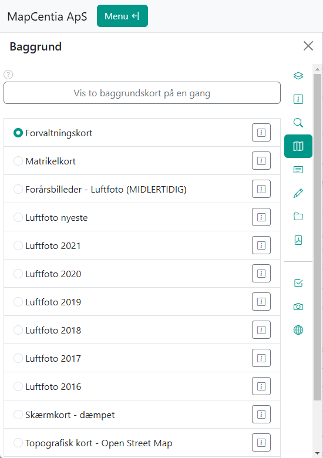
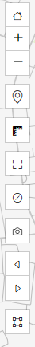

.. _gettingstarted:

.. |gc2| raw:: html

  <abbr title="MapCentia Geocloud2">GC2</abbr>

*****************************************************************
Kom godt i gang med Vidi
*****************************************************************

.. topic:: Overview

    :Date: |today|
    :Vidi-version: 2020.11.0
    :Forfatter: `giovanniborella <https://github.com/giovanniborella>`_

.. contents:: 
    :depth: 3

Hvad er Vidi?
================================================================= 

Vidi er en HTML5 applikation til at vise og forespørge på kortdata fra |gc2|. 

Klienten læser information fra GC2's meta-api, og viser en moderne kort-browser med lag for den specificerede PostGreSQL 

Her er et udpluk af nogle af funktionaliteterne.

* Avanceret forespørgsler med buffer
* Print til PDF
* Klar til udvidelser

Vidi er ikke bygget ind i GC2, men kræver sin egen installation.

`Du kan prøve det live her <https://kort.geofyn.dk/>`_

Kortvinduet
-----------------------------------------------------------------

.. figure:: ../../_media/gettingstarted-main.png
    :width: 400px
    :align: center
    :name: sidebar-expanded
    :figclass: align-center

    Startskærmen i Vidi

.. _gettingstarted_menu:

Menu
^^^^^^^^^^^^^^^^^^^^^^^^^^^^^^^^^^^^^^^^^^^^^^^^^^^^^^^^^^^^^^^^^

    Menuen i Vidi

Menuen indholder de fleste funktionalitet til kortet, og indeholder lagstyring, søgeværktøjer, info-værktøj, print og meget mere.

Menuen gemmer sig selv hvis kortvinduet er for smalt, men kan bringes frem igen ved hjælp af ``Menu``-knappen.

.. _gettingstarted_navigate:

Navigér
^^^^^^^^^^^^^^^^^^^^^^^^^^^^^^^^^^^^^^^^^^^^^^^^^^^^^^^^^^^^^^^^^

Panorer i kortet ved at klikke og trække med musen. Det er også muligt at bruge piletasterne på tastaturet.

Zoom ind og ud ved at bruge scrollhjulet på musen eller ved at klikke på plus- og minusknapperne i værktøjslinjen. Det er også muligt at bruge ``+`` og ``-`` på tastaturet. 

.. note::
  Der kan være begrænsninger på zoomniveauet, afhængigt af datakilden.

Zoom ind på et bestemt område ved at holde ``Shift`` nede, klikke og trække en boks i kortet. Eller kan man bruge ``Zoom til udsnit``-knappen i værktøjslinjen.

Det er muligt at komme tilbage til det oprindelige kortudsnit ved at klikke på ``Hjem``-knappen i værktøjslinjen.

Man kan gå tilbage i kortudsnit ved at bruge ``Forrige udsnit``-knappen i værktøjslinjen, her kan man også gå frem igen ved at bruge ``Næste udsnit``-knappen.

.. _gettingstarted_controls:

Værktøjslinjen
-----------------------------------------------------------------

    Værktøjslinjen i Vidi

Værktøjslinjen indeholder en række værktøjer til at interagere med kortet. Værktøjerne vil altid være tilgængelige i toppen af kortet.

Værktøjerne i billedet er (oppefra):

* ``Hjem``
* ``Zoom ind``
* ``Zoom ud``
* ``Geolokation``
* ``Måleværktøj``
* ``Fuldskærm``
* ``Ryd kort``
* ``screenshot``  
* ``Forrige udsnit``
* ``Næste udsnit``
* ``Zoom til udsnit``

