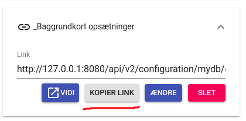

.. _configjson:

#################################################################
Kørselskonfiguration (configs)
#################################################################

.. topic:: Overview

    :Date: |today|
    :Vidi-version: 2024.11.0
    :Forfattere: `giovanniborella <https://github.com/giovanniborella>`_ | `mapcentia <https://github.com/mapcentia>`_

.. contents::
    :depth: 4

Når vidi startes i browseren læses værdier ind fra :ref:`configjs`. I flere tilfælde kan denne konfiguration ændres til eksempelvis at inkludere bestemte extensions, eller print-templates.

Vidi startes med en URL som denne (uden fragments [#fragment]_):

``https://vidi.dk/app/mindb/?config=minconfig.json``

Som kan læses sådan:

``https://<host>/app/<database>/?config=<kørselskonfiguration>.json``

.. _configjs_schemata:

schemata
*****************************************************************

Her angives hvilke lag, der skal hente ind i lagtræet. Der er tre måder at angive på:

* *Schema*. Alle lag i schemaet.
* *Lag*. Et enkelt lag.
* *Tag*. Alle lag med taggen.

De tre måder kan kombineres.

.. code-block:: json

    "schemata": [
        "my_schema",
        "my_schema.my_layer",
        "tag:my_tag_1",
        "tag:my_tag_2"
    ],

.. note::
    Lag skal være placeret i en laggruppe for at kunne hentes ind. Dette gøres i GC2 Admin.

.. _configjs_enabledextensions:

enabledExtensions
*****************************************************************

Her angives hvilke extensions, som skal aktiveres.

.. code-block:: json

    "enabledExtensions": [
        "conflictSearch",
        "streetView",
        "session",
        "coordinates",
        "offlineMap",
        "editor",
        "configSwitcher",
        "embed"
    ],

.. _configjs_extensionconfig:

extensionConfig
*****************************************************************

Her kan opsætningen af de enkelte extensions laves. Det er ikke alle extensions, som har sine egne indstillinger.

Opsætningen sker efter følgende princip:

.. code-block:: json

    "extensionConfig": {
        "extensionNavn1": {},
        "extensionNavn2": {}
    }

Her følger hvordan de enkelte extensions kan opsættes (Pt. omfatter denne del af dokumentationen ikke alle extensions)

.. code-block:: json

    "extensionConfig": {
        "streetView": {
            "cowi": "https://cmv.cowi.com/?...",
            "mapillary": "https://mapillary.com/app/?..."
        "symbols": {
            "files": [
                {"file": "symbolset1.json", "title": "Symbolsæt 1"},
                {"file": "symbolset2.json", "title": "Symbolsæt 2"}
            ],
            "options": {
                "scale": true,
                "rotate": true,
                "delete": true,
                "callback": "function(file, state, operation){alert('Et symbol placeret')}",
                "validate": "function(file, group, state){return true}"
            },
            "symbolOptions": {
                "symbol34.svg": {
                    "onlyOne": true,
                    "rotate": false,
                    "callback": "function(file, state, operation){alert('Symbol 34 placeret')}"
                }
            }
        }
    }

.. _configjs_enabledprints:

enabledPrints
*****************************************************************

Her angives hvilke print-templates der skal være adgang til. Angives flere end én kan brugeren vælge mellem dem i print-dialogen.

.. code-block:: json

    "enabledPrints": ["print", "print_sagsbehandler"],

.. _configjs_enabledsearch:

enabledSearch
*****************************************************************

Her angives hvilket søgemodul, der skal være aktiveret. Pt. er der to standard moduler:

* ``danish`` Søgning på danske adresser, jordstykker og ejendomme
* ``google`` Google's Place Search (kræver Google API Key. Se :ref:`configjs_searchconfig`)

.. code-block:: json

    "enabledSearch": "danish",

.. _configjs_searchconfig:

searchConfig
*****************************************************************

Her kan det valgte søgemodul konfigureres.

* ``size`` Hvor mange forslag skal der vises.
* ``komkode`` Hvilket eller hvilke kommunekoder skal søgningen omfatte. Angives enten som "851", ["851", "727"] eller "*"
* ``esrSearchActive`` Aktiver søgning på esr ejendomsnummer
* ``sfeSearchActive`` Aktiver søgning på sfe ejendomsnummer
* ``placeholderText`` Udskift standard-teksten med en anden
* ``google`` Google API key.
* ``extraSearches`` Liste af ekstra søgninger.

.. code-block:: json

    "searchConfig": {
        "size": 10,
        "komkode": "851",
        "esrSearchActive": true,
        "sfeSearchActive": true,
        "placeholderText": "Søg på et eller andet",
        "google": {"apiKey": "abc123"}
    },

.. note::
    Indstillerne har kun indflydelse på "danish" søgemodulet Kun "google" vedrører Google Place Search og behøver ikke udfyldes, hvis det ikke bruges. Google API kan også sættes i GC2.

Det er muligt at opsætte flere søgemoduler, blandt andet ved at udstille et eller flere lag i en elasticsearch. For at implementere lagene i søgefeltet, skal lagene tilføjes til konfigurationen.

De ekstra søgemoduler kan opsættes således:

.. code-block:: json

    searchConfig: {
        extraSearches: [,{
            name: "stednavne_search",
            db: "dk",
            host: "https://dk.gc2.io",
            heading: "Stednavne",
            zoom: 20, // Zoomniveau, når der klikkes på et søgeresultat
            index: {
                name: "stednavne/navne_samlet",
                field: "string",
                key: "gid",
            },
            relation: {
                name: "stednavne.navne_samlet_geom",
                key: "gid",
                geom: "the_geom"
            }
        }]
    },

.. _configjs_template:

template
*****************************************************************

Her angives hvilken template, som skal bruges. Angives det ikke, bruges standard-templaten ``default.tmpl``.
Egne Templates kan placeres på egen server ved angivelse af :ref:`configUrl<configjs_configurl>` indstillingen.

.. code-block:: json

    "template": "default.tmpl",

.. _configjs_brandname:

brandName
*****************************************************************

Her kan sættes en tekst som placeres vha. en placeholder i templates.

.. code-block:: json

    "brandName": "Mit brandnavn",

.. _configjs_baselayers:

baseLayers
*****************************************************************

Opsætning af tilgængelige base layers kan ske på fire forskellige metoder:

* Indbyggede lag
* WMS lag
* XYZ lag
* GC2 lag

.. code-block:: json

    "baseLayers": [
        {"id": "osm", "name": "Open Street Map"},
        {"id": "bingRoad", "name": "Bing Road"},
        {"id": "bingAerial", "name": "Bing Aerial"},
        {"id": "hereNormalDay", "name": "HERE Normal Day"},
        {"id": "hereNormalDayGrey", "name": "HERE Normal Day Grey"},
        {"id": "hereNormalNightGrey", "name": "HERE Normal Night Grey"},
        {"id": "hereSatelliteDay", "name": "HERE Satellite Day"},
        {"id": "hereHybridDay", "name": "HERE Hybrid Day"},
        {"id": "googleStreets", "name": "Google Streets"},
        {"id": "googleHybrid", "name": "Google Hybrid"},
        {"id": "googleSatellite", "name": "Google Satellite"},
        {"id": "googleTerrain", "name": "Google Terrain"},
        {
            "inDrawer": true,
            "thumbnail": "https://mapcentia.github.io/vidi_configs_common/forvaltningskort.png",
            "type": "wms",
            "url": "https://services.kortforsyningen.dk/service?SERVICENAME=forvaltning2&token=abc123&",
            "layers": ["Basis_kort", "Navne_basis_kort", "Husnummer"],
            "id": "Basis_kort",
            "name": "Forvaltningskort",
            "description": "Basis_kort",
            "attribution": "Styrelsen for Dataforsyning og Effektivisering",
            "minZoom": 8,
            "maxZoom": 22,
            "maxNativeZoom": 22
        },
        {
            "type": "XYZ",
            "url": "https://m3.mapserver.mapy.cz/base-m/{z}-{x}-{y}?s=0.3&dm=Luminosity",
            "id": "mapy",
            "name": "Mapy",
            "description": "Kort fra Mapy",
            "attribution": "Mapy",
            "minZoom": 8,
            "maxZoom": 20,
            "maxNativeZoom": 19
        },
        {
            "type": "gc2",
            "id": "geodk.bright-01052019",
            "name": "GeoDanmark kort",
            "db": "baselayers",
            "host": "https://dk.gc2.io",
            "config": {
                "minZoom": 8,
                "maxZoom": 30,
                "maxNativeZoom": 26,
                "attribution": "&copy; SDFE & MapCentia ApS"
            }
        }
    ],

De to egenskaber ``inDrawer`` og ``thumbnail`` anvendes til baggrundskort "skuffe" og toggle knap. Se mere på :ref:`configjs_baselayerdrawer`

Til WMS baggrundskort fra Datafordeler og Dataforsyningen kan der anvendes en proxy, som til dels fixer et problem med Datafordeler og til dels kan forsyne kaldene med brugernavn/kodeord eller token, så disse ikke bliver eksponeret til Vidi brugerne.

Se hvordan bruger-information opsættes i Systemkonfigurationen :ref:`configjs_df`

Derefter kan WMS'er opsættes således. Fx hvis man ønsker at anvende:

``https://services.datafordeler.dk/GeoDanmarkOrto/orto_foraar/1.0.0/WMS``

skal "url" angives til:

``/api/datafordeler/GeoDanmarkOrto/orto_foraar/1.0.0/WMS``

Vidi sørger så for at tilføje bruger-infomationen og tilrette URL.

.. code-block:: json

    "baseLayers": [
        {
            "type": "wms",
            "url": "/api/datafordeler/GeoDanmarkOrto/orto_foraar/1.0.0/WMS",
            "layers": ["geodanmark_2020_12_5cm"],
            "id": "geodanmark_2020_12_5cm",
            "name": "TEST geodanmark_2020_12_5cm",
            "description": "geodanmark_2020_12_5cm",
            "attribution": "Styrelsen for Dataforsyning og Effektivisering",
            "minZoom": 8,
            "maxZoom": 22,
            "maxNativeZoom": 22,
            "transparent": true
        },
        {
            "type": "wms",
            "url": "/api/dataforsyningen/topo_skaermkort_DAF",
            "layers": ["topo_skaermkort"],
            "id": "topo_skaermkort",
            "name": "TEST topo_skaermkort",
            "description": "geodanmark_2020_12_5cm",
            "attribution": "Styrelsen for Dataforsyning og Effektivisering",
            "minZoom": 8,
            "maxZoom": 22,
            "maxNativeZoom": 22,
            "transparent": true
        }
    ]

.. note::
    HERE, Bing og Google Maps kræver API nøgle opsat i GC2. Google Maps fungerer på en anden måde end andre lag og langt fra optimalt. Fx kan man ikke printe Google Maps.

.. _configjs_baseLayergroups:

baseLayerGroups
*****************************************************************

Det er muligt at gruppere flere baggrundskort i en gruppe. Grupperne kan vises indledningsvis i en skuffe.

For at gruppere baggrundskortene, angives strukturen i ``baseLayerGroups``. De enkelte baggrundskort angives med samme id som beskrevet i :ref:`configjs_baselayers`.

.. code-block:: json

    "baseLayerGroups": [
        {
            "groupName": "Hexagon DDO ortofoto 2022-1995 + 1954",
            "layers": [
                "DK-DDOland2022_125mm_UTM32ETRS89",
                "DK-DDOland2020_125mm_UTM32ETRS89",
                "DK_HxIP-ORTO2018_30cm_UTM32ETRS89",
                "DK-DDOland2016_125mm_UTM32ETRS89",
                "DK-DDOland2015_25CM_UTM32ETRS89",
                "DK-DDOland2014_12CM_UTM32ETRS89",
                "DK-DDObasis2013_25cm_UTM32ETRS89",
                "DK-DDOland2012_125mm_UTM32ETRS89",
                "DK-DDOland2010_125mm_UTM32ETRS89",
                "DK-DDOland2008_125mm_UTM32ETRS89",
                "DK-DDOland2006_25cm_UTM32ETRS89",
                "DK-DDOland2004_25cm_UTM32ETRS89",
                "DK-DDOland2002_40cm_UTM32ETRS89",
                "DK-DDOland1999_40cm_UTM32ETRS89",
                "DK-DDOland1995_80cm_UTM32ETRS89",
                "DK-DDOland1954_25cm_UTM32ETRS89"
            ]
        },
        {
            "groupName": "GeoDanmark forår ortofoto 2023-2015 + quick-orto",
            "layers": [
                "ortofoto_foraar_temp_DF",
                "ortofoto_foraar_2023",
                "ortofoto_foraar_2022",
                "ortofoto_foraar_2021",
                "ortofoto_foraar_2020",
                "ortofoto_foraar_2019",
                "ortofoto_foraar_2018",
                "ortofoto_foraar_2017",
                "ortofoto_foraar_2016",
                "ortofoto_foraar_2015"
            ]
        }
    ]

.. _configjs_aboutbox:

aboutBox
*****************************************************************

Her kan sættes en tekst eller HTML som vises i About Box.

.. code-block:: json

    "aboutBox": "
Her kan der indsættes HTML
",

.. _configjs_startupmodal:

startUpModal
*****************************************************************

Hvis angivet, vil et modal-vindue vises ved opstart med tekst eller HTML. Vinduet kan skjules en gang eller for altid (indtil cookies nulstilles eller indeholdet ændres).

.. code-block:: json

    "startUpModal": "
Her kan der indsættes HTML
",

.. _configjs_startupmodalsupressiontemplates:

startupModalSupressionTemplates
*****************************************************************

:ref:`startUpModal <configjs_startupmodal>` kan undertrykkes ved udvalgte templates. Templates kan angives ved navn eller regular expression.

.. code-block:: json

    "startupModalSupressionTemplates": ["print.tmpl", "blank.tmpl", {
        "regularExpression": true,
        "name": "print_[\\w]+\\.tmpl"
    }],

.. _configjs_featureinfoonmap:

featureInfoTableOnMap
*****************************************************************

Når denne er sat til ``true`` vises feature-info tabellerne i en popup på kortet i stedet for i sidepanelet. Det gør indstillingen veleget til embed template.
Ved brug af "avanceret forespørgelse" vises tabellerne dog stadig i sidepanelet.

.. code-block:: json

    "featureInfoTableOnMap": true,

.. figure:: ../../_media/feature-info-table-on-map.png
    :width: 400px
    :align: center
    :name: feature-info-table-on-map
    :figclass: align-center
|

.. note::
    Kan ikke anvendes i sammenhæng med :ref:`configjs_crossmultiselect`

.. _configjs_crossmultiselect:

crossMultiSelect
*****************************************************************

Når denne er sat til ``true`` vil feature info klik fange både raster- og vektor-lag og opstille de enkelte resultater i en "harmonika". Derved inddeles resultatet ikke efter hvilke lag de tilhører.
Overskrifterne har to dele:

* ``Accordion summery prefix`` En fritekst efter eget valg.
* ``Accordion summery`` En celle værdi, angivet med kolonnenavn.

Ovenstående sættes i GC2 Meta.

.. code-block:: json

    "crossMultiSelect": true,

.. figure:: ../../_media/cross-multi-select.png
    :width: 400px
    :align: center
    :name: cross-multi-select
    :figclass: align-center
|

.. note::
    Hvis extension ``editor`` er aktiv vil ``crossMultiSelect`` bliver sat til ``false``.

.. _configjs_activatemaintab:

activateMainTab
*****************************************************************

Sæt hvilket modul, som skal være aktivt fra starten. Mulighederne er:

* search
* info
* layer
* baselayer
* legend
* draw
* state-snapshot
* print
* conflict
* streetView
* coordinates

.. code-block:: json

    "activateMainTab": "info"

.. _configjs_cssfiles:

cssFiles
*****************************************************************

Load eksterne CSS filer. Filerne skal placeres på en HTTP server, som forbindes til vha. :ref:`configUrl<configjs_configurl>`

.. code-block:: json

  "cssFiles": [
       "myStyles1.css",
       "myStyles2.css"
  ]

.. _configjs_dontuseadvancedbaselayerswitcher:

dontUseAdvancedBaseLayerSwitcher
*****************************************************************

Deaktiver dobbelt baggrundskort funktionen.

.. code-block:: json

    "dontUseAdvancedBaseLayerSwitcher": true

.. _configjs_advancedbaselayerswitcher

advancedBaseLayerSwitcher
*****************************************************************

Opsætning af dobbelt baggrundskort funktionen.

- ``mode`` bestemmer om kun Slider ``1`` eller kun Overlap ``2`` eller begge ``3`` skal være tilgængelig. Default er ``3`` (begge).

- ``default`` bestemmer om det er Silder ``1`` eller Overlap ``2``, der skal være aktiv fra starten. Default er ``1`` (Slider). Hvis ``mode`` er ``1`` eller ``2``, så er ``default`` ligegyldig.

- ``active`` bestemmer om dobbelt baggrundskort funktionen skal være aktiv fra starten. Default er ``false``.

.. code-block:: json

    "advancedBaseLayerSwitcher": {
        "mode": 3,
        "default": 1,
        "active": false,
    }

.. _configjs_infoclickcursorstyle:

infoClickCursorStyle
*****************************************************************

Sæt hvilken CSS cursor style markøren skal have når feature-info modulet er aktivt. Default er "crosshair".

Andre muligheder kan ses `her <https://developer.mozilla.org/en-US/docs/Web/CSS/cursor>`_.

.. code-block:: json

    "infoClickCursorStyle": "crosshair"

.. _configjs_showlayergroupcheckboxes:

showLayerGroupCheckbox
*****************************************************************

Viser en tjekboks i hver lag-gruppe og under-gruppe, som tænder/slukker alle lag i den pågældende gruppe.

.. code-block:: json

    "showLayerGroupCheckbox": true

.. _configjs_activelayers:

activeLayers
*****************************************************************

Liste over lag, som skal tændes fra starten. Lag angives schema qualified og med evt. type præfiks (v:, mvt:, w:). De angivne lag behøver ikke at være includeret i :ref:`schemata<configjs_schemata>`. Hvis Vidi startes med et projekt link, vil denne konfiguration blive ignoreret.

.. code-block:: json

    "activeLayers": [
        "schema.lag1",
        "v:schema.lag2"
    ]

.. _configjs_removedisabledlayersfromLegend:

removeDisabledLayersFromLegend
*****************************************************************

Hvis sættes til true, så fjernes lag fra signaturforklaringen, når laget slukkes. Ellers forbliver det på signaturen, men tjekboksen bliver tom. Default er "false".

.. code-block:: json

    "removeDisabledLayersFromLegend": true

.. _configjs_autoPanPopup:

autoPanPopup
*****************************************************************

Denne indstilling bevirker, at når en pop-up åbnes, så panoreres kort således, at pop-up'en kommer indenfor kortets udsnit. Bemærk, at indstillingen helst skal sættes til "false", hvis der anvendes vektor-lag med dynamisk loading af data, fordi panoreringen evt. kan bevirke reload af data og derefter lukkes pop-up'en Default er "false".

.. code-block:: json

    "autoPanPopup": true

.. _configjs_vectorTable:

vectorTable
*****************************************************************

Denne indstilling styrer om :ref:`vektorlag tabellen<gc2mata_vectorsettings>` skal vises til højre for eller i bunden af kortet. Endvidere kan højde/bredde styres. Hvis positionen er sat til ``right``
vil kun ``width`` have effekt og tabellen vil altid fylde højden ud. Hvis position er sat til ``bottom`` vil kun ``height`` have effekt og bredden bliver den samme som kortet.
``width`` kan både være relativ ``%`` og absolute ``px`` mens ``height`` kun kan angives som absolute ``px``. Hvis ikke denne indstilling sættes bruges default værdier som vist nedenunder.

.. code-block:: json

    "vectorTable": {
        "position": "bottom",
        "width": "30%",
        "height": "250px"
    }

.. _configjs_initFunction:

initFunction
*****************************************************************

Her kan angives en JavaScript funktion eller kommandoer, som bliver kørt når Vidi er klar.

``initFunction`` angives på forskellige måder:

Som et funktions-kald startende med `function()` og den efterfølgende blok er den, som bliver eksekveret. Her er der mulighed for at skrive flere statements, som er afhængige af hinanden:

.. code-block:: json

    "initFunction": "function(){let text = 'Hello world'; alert(text)}"

Som en enkelt kommando:

.. code-block:: json

    "initFunction": "alert('Hello world')"

Som en liste af kommandoer uafhængige kommandoer:

.. code-block:: json

    "initFunction": [
        "alert('Hello')",
        "alert('world')"
    ]

Nedenstående vil IKKE virke. Her skal den øverste metode med at wrappe det hele i et samlet funktionskald anvendes:

.. code-block:: json

    "initFunction": [
        "let text='Hello world'",
        "alert(text)"
    ]

En typisk brug af ``initFunction`` er at lave "virtuelle" klik på i brugergrænsefalden. Fx tænd signaturen automatisk fra start:

.. code-block:: json

    "initFunction": "document.querySelector('#btn-show-legend-in-map').click()"

.. _configjs_initZoomCenter:

initZoomCenter
*****************************************************************

Hvis sat vil Vidi starte op på det angivet zoom/center. Denne indstilling vil have forrang over zoom/center sat i URL og projekt-link. Kan fx anvendes til at sikre, at alle indlejrede kort starter med samme zoom/center.

Angives således `/z/x/y`. Dette svarer til det, der vises i Vidi URL'en.

.. code-block:: json

    "initZoomCenter": "/16/9.875/56.142"

.. _configjs_popupdraggable:

popupDraggable
*****************************************************************

Hvis sat til `true` kan man flytte feature-info pop-up'en på kortet.

.. code-block:: json

    "popupDraggable": false

.. _configjs_title:

title
*****************************************************************

Sæt titel på siden (den der vises på browser-fanen).

.. code-block:: json

    "title": "Mit overfede kort"

.. note::
    Titlen bliver sat dynamisk efter Vidi er startet og derfor vil titlen under opstart et øjeblik være sat til standardteksten.

.. _configjs_baselayerdrawer:

baselayerDrawer
*****************************************************************

Anvend baggrundskort "skuffe" i stedet for toggle knappen. Skuffen kan indeholde et vilkårlig antal muligheder. Udvælgelsen af baggrundskort til skuffen og thumbnails/ skal opsættes i :ref:`configjs_baselayers`

.. figure:: ../../_media/baselayer-drawer.png
    :align: center
    :name: feature-info-table-on-map
    :figclass: align-center
|

.. code-block:: json

    "baselayerDrawer": true

.. note::
    Template ``default.tmpl`` viser hverken skuffe eller toggle knap. Anvendes på ``embed.tmpl`` og lign., som ikke har den store baggrundskortsvælger.

.. _configjs_showoffcanvas:

showOffcanvas
*****************************************************************

Her kan angives, om menuen skal være vist fra starten. Værdierne kan være ``true``, ``false`` eller ``"mobile"``. Den sidste viser menuen, hvis skærmen er bred men ikke på fx en smal telefonskærm.

.. code-block:: json

    "showOffcanvas": false

.. _configjs_expandfirstinlayertree:

expandFirstInLayerTree
*****************************************************************

Angiver om den første/øverste gruppe i lagtræet skal være foldet ud fra starten.

.. code-block:: json

    "expandFirstInLayerTree": false

.. _configjs_infocallback:

infoCallback
*****************************************************************

En funktion som køres, når feature info rammer et eller flere lag. En liste af med de ramte lag sendes med.

.. code-block:: json

    "infoCallback": "function(layers){console.log('You hit:', layers)}"

.. _configjs_emptyinfocallback:

emptyInfoCallback
*****************************************************************

En funktion som køres, når feature info IKKE rammer noget.

.. code-block:: json

    "emptyInfoCallback": "function(){console.log('You hit nothing')}"

.. _configjs_dateformats:

dateFormats
*****************************************************************

Det er muligt at formatere datoer i templates (både popup- og felt-templates). Det gøres ved at kalde en template "helper" og angive et defineret datoformat.

Man kan definere et eller flere mulige datoformater i config'en:

.. code-block:: json

    "dateFormats": {
        "kort": "D MMMM - YYYY",
        "lang": "dddd DD.MM.YYYY HH:mm"
    }

Derefter kan formaterne anvendes således i templates:

.. code-block:: handlebars

    {{formatDate dato "lang"}}

Hvor ``formatDate`` er helper funktionen, ``dato`` er feltet med datoer og ``"lang"`` er henvisningen til et af de definerede formater i config'en.

Hvis ens datoer ikke er et standardformat, men fx Plandata's, hvor datoer bliver angivet som fx `20250206` (6. februar 2025), kan man tilføje et inputformat som her:

.. code-block:: handlebars

    {{formatDate dato "lang" "YYYYMMDD"}}

.. note::
    Se `mulige datoformateringer <https://day.js.org/docs/en/display/format>`_

    Læs mere om :ref:`templates`

.. _configjs_dateformats:

statelessDraw
*****************************************************************

Hvis man ikke vil have at tegninger "hænger ved" efter refresh af browser, kan denne option sættes til `true`.

.. code-block:: json

    "statelessDraw": false

.. _configjs_openlayertreegroups:

openLayerTreeGroups
*****************************************************************

Angiv hvilke grupper, som skal være foldet ud i lagtræet fra starten.

.. code-block:: json

    "openLayerTreeGroups": ["Gruppe1", "Gruppe2"]

.. _configjs_crs:

crs
*****************************************************************

Angiv den kort projektion/grid, som skal anvendes. Default er `EPSG3857` and den eneste anden mulighed er `EPSG25832`, som er det danske UTM32 grid.

.. code-block:: json

    "crs": "EPSG25832"

#################################################################
Referencer
#################################################################

En konfiguration kan henvise til andre konfigurationer og på den måde kan dele af en opsætning genbruges i flere konfigurationer.

Fx kan man definere sine standard baggrundskort i en konfiguration og så henvise til den fra andre konfigurationer:

Først baggrundskort opsætningen:

.. code-block:: json

    [
        {
            "id": "osm",
            "name": "Open Street Map"
        },
        {
            "id": "bingRoad",
            "name": "Bing Road"
        },
        {
            "id": "bingAerial",
            "name": "Bing Aerial"
        }
    ]

Og så en konfiguration, som henviser til ovenstående:

.. code-block:: json

    {
        "schemata": [
            "public"
        ],
        "brandName": "MapCentia ApS",
        "aboutBox": "
My awesome web map
",
        "template": "default.tmpl",
        "baseLayers": {
            "$ref": "http://127.0.0.1:8080/api/v2/configuration/mydb/configuration_defs_65a15aa97c2df746526680.json"
        }
    }

Som det ses, så henviser `baseLayers` til konfigurationen med baggrundskort. Dvs. at indholdet i `baseLayers` bliver skiftet ud med indholdet i den konfiguration, der henvises til.

Det er også muligt at henvise længere ned i en konfiguration. Fx her henvises til en anden konfigurationens `baseLayers` egenskab:

.. code-block:: json

    {
        "baseLayers": {
            "$ref": "http://127.0.0.1:8080/api/v2/configuration/mydb/configuration_en_anden_config_65a15aa97c2df746526680.json#/baseLayers"
        }
    }

URL'en til konfigurationen fås ved at anvende knappen KOPIER LINK:

.. note::
    Henvisninger virker kun for konfigurationer lavet i GC2 Kontrolcenter. Konfigurationer, som anvendes i henvisninger, skal være udgivet. Hvis en henvisning ikke virker (fx hvis url'en er forkert) vises "$ref" egenskaben uforandret.

.. rubric:: Fodnoter

.. [#fragment] Et fragment er den del af en URL der kommer efter `#`.
